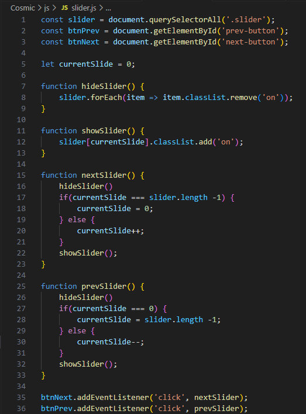
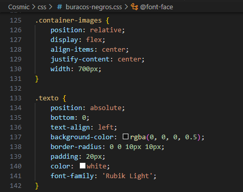
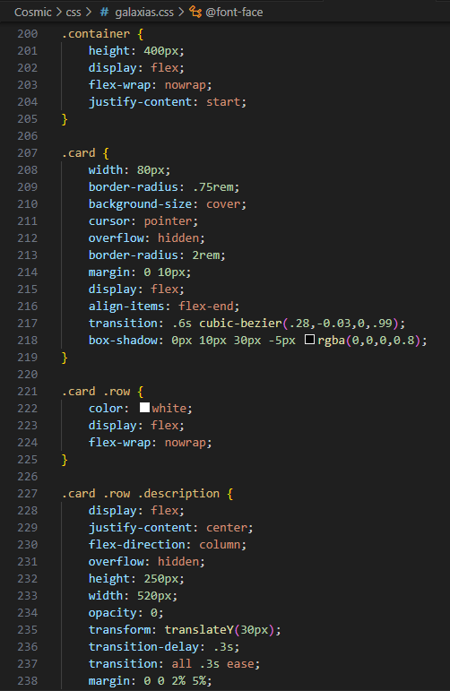

# Trabalho Prático 1 - Cosmic

**Nome:** Luiza Marques Silva - **Turma:** Informática 1A T2

**URL do site:** https://luizamarquessilva14013.github.io/cosmic/

## Itens Adicionais

2. Slider de imagens com JavaScript

  

5. Elementos com posicionamento não estático

   

6. Exibição de um vídeo

   

9. Usar flexbox ou grid

   
